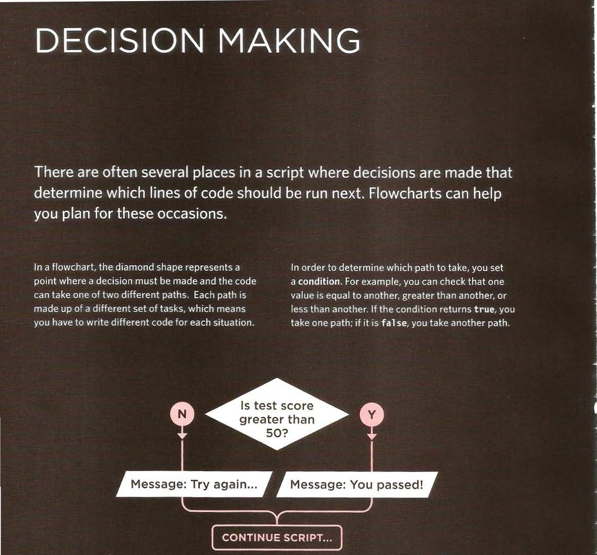

# Text in html
1. Structural and semantic markup
2. Headings and paragraphs
3. Bold, italic, emphasis

 Structural and semantic markup

When creating a web page, you add tags (known as **markup**) to the contents of the page. 
These tags provide extra *meaning* and allow browsers to show users the appropriate structure for the page.

* __Structural markup__: the elements that you can use to describe both headings and paragraphs

* __Semantic markup__: which provides extra information; such as where emphasis is placed in a sentence, that something you have written is a quotation (and who said it), the meaning of acronyms, and so on

 Headings and paragraphs

Headings

HTML has *six* "levels" of __headings__:
< h1> is used for main headings
< h2> is used for subheadings
If there are further sections
under the subheadings then the
< h3> element is used,
 and so on...

 These are the **headings** for html and how they are written
 

Paragraphs

**< p>** To create a paragraph, surround
the words that make up the
paragraph with an opening **< p>**
tag and closing **< /p>** tag.

Bold, italic, emphasis

Bold & Italic

**< b>**
By enclosing words in the tags
**< b>** and **< /b>** we can make
characters appear bold.

**< i>**
By enclosing words in the tags
**< i>** and **< /i>** we can make
characters appear italic.

**Superscript & Subscript**

**< sup>**
The **< sup>** element is used to contain characters that should be superscript such as the suffixes of dates or mathematical concepts like raising a number to a power such as 22.

The **< sub>** element is used to contain characters that should be subscript. It is commonly used with foot notes or chemical formulas such as H2O.

**Line Breaks & Horizontal Rules**

< br />
As you have already seen, the browser will automatically show each new paragraph or heading
on a new line. But if you wanted to add a line break inside the middle of a paragraph you can
use the line break tag < br />.

**< hr />**
To create a break between themes — such as a change of topic in a book or a new scene
in a play — you can add a horizontal rule between sections using the **< hr />** tag.

It works in this manner 

 Semantic Markup

There are some text elements that are not intended to affect the structure of your web pages, but they do add extra information to the pages — they are known as semantic markup.

**Strong & Emphasis**

**< strong>**
The use of the **< strong>** element indicates that its content has strong importance. 
For example, the words contained in this element might be said with strong emphasis.

By default, browsers will show the contents of a **< strong>** element in bold.

**< em>**
The **< em>** element indicates emphasis that subtly changes the meaning of a sentence.
By default browsers will show the contents of an **< em>** element in italic.

**< blockquote>**
The **< blockquote>** element is used for longer quotes that take up an entire paragraph.
 Note how the *< p>* element is stillused inside the **< blockquote>** element.
 
 **< q>**
The **< q>** element is used for shorter quotes that sit within a paragraph.
 Browsers are supposed to put quotes around the **< q>** element, however
Internet Explorer does not, therefore many people avoid using the **< q>** element.

**Abbreviations & Acronyms**

**< abbr>** 
If you use an abbreviation or an acronym, then the **< abbr>** element can be used. A title
attribute on the opening tag is used to specify the full term.

Summary TEXT

HTML elements are used to describe the structure of the page (e.g. headings, subheadings, paragraphs).
They also provide semantic information (e.g. where emphasis should be placed, the definition of any
acronyms used, when given text is a quotation).

CSS

__Css__ stands for Cascading Style Sheets.

CSS allows us to create rules that _specify_ how the content of
an element should appear in addition it make web pages more __attractive__,
controlling the design of them.

Using CSS, you could add a _border_ around any of the boxes, specify its _width_ and _height_, or add a _background color_. You could also control text inside a box — for example, its color, size, and the typeface used.

### Things CSS can do

With _boxes_ can change Width and height Borders (color, width, and style) Background color and images Position in the browser window.

And with _texts_ can change Typeface Size Color Italics, bold, uppercase, lowercase and small-caps.

CSS selectors

|Selector| 	Example |	Example description |
|---------|----------|----------------------|
| #id |	#firstname |	Selects the element with id="firstname" |
| .class | 	.intro |	Selects all elements with class="intro" |
| element.class	| p.intro	| Selects only 
 elements with class="intro"|
|*	|*	|Selects all elements|
|element	|p	|Selects all < p> elements|
|element,element,..	|div, p	|Selects all < div> elements and all < p> elements|

JavaScript

**Js**  is a programming language that conforms to the ECMAScript specification.**Js** is high-level, often just-in-time compiled, and multi-paradigm. It has curly-bracket syntax, dynamic typing, prototype-based object-orientation, and first-class functions.

Alongside HTML and CSS, JavaScript is one of the core technologies of the World Wide Web. **Js** enables interactive web pages and is an essential part of web applications. The vast majority of websites use it for client-side page behavior, and all major web browsers have a dedicated JavaScript engine to execute it.

**Script** is a series of instructions that a computer can follow one-by-one.
Each individual instruction or step is known as a statement.
Statements should end with a semicolon.

A script will have to temporarily store the *bits of information* it needs to do its job. It can store this data in **variables**.

A *variable* is a good name for this concept because the data stored in a variable can change (or vary)
each time a script runs.

Data Types

 

* Strings
 The strings data type consists of
  letters and other characters.
* Numbers
 The numeric data type handles
  numbers.
* Boolean
 Boolean data types can have one
  of two va lues: true or false.

 Varibales and Arrays

There are **six** rules to name a variable

1. The name must begin with a letter, dollar sign ($),or an underscore (_). It must __not__ start with a number.

2. The name can contain letters, numbers, dollar sign ($), or an underscore (_). Note that you must not use a dash(-) or a period (.) in a variable name.

3. You __cannot__ use keywords or reserved words. Keywords are special words that tell the interpreter to do something. For example, var is a keyword used to declare a variable. Reserved words are ones that may be used in a future version of JavaScript.
[See keywords and reserved words for Js](https://www.w3schools.com/js/js_reserved.asp)

4. All variables are __case sensitive__, so score and Score would be different variable names, but it is bad practice to create two variables that have the same name using different cases.

5. Use a name that describes the kind of information that the variable stores. For example, __firstName__ might be used to store a person's first name, __lastName__ for their last name, and __age__ for their age.

6. If your variable name is made up of more than one word, use a capital letter for the first letter of every word after the first word.For example, firstName rather than firstname (this is referred to as *camel case*). You can also use an underscore between each word (you __cannot__ use a dash).

 ARRAYS

An array is a special type of variable. It doesn't
just store one value; it stores a __list__ of values.

For example, an array can be suited to storing the individual items on a shopping __list__ because it is a __list__ of related items.

You create an array and give it a name just like you would any other variable (using the var **keyword** followed by the name of the array) and this technique known as an **_array literal_**.

The values are assigned to the array inside a pair of square brackets, and each value is __separated__ by a comma.

ARITHMETIC OPERATORS

|Operator |	Operation |
|---------|-----------|
|+	|Addition|
|-	|Subtraction|
|*	|Multiplication|
| /	|Division|
| %	|Modulo Operation (Remainder after division)|

Decisions and Loops

Loops

Loops can **execute** a block of code a number of times.

* For loop
for (statement 1; statement 2; statement 3) {
  // code block to be executed
}

Statement 1 is executed **(one time)** before the execution of the code block.

Statement 2 defines the **condition** for executing the code block.

Statement 3 is executed **(every time)** after the code block has been executed.

* While loop
The **while** loop loops through a block of code as long as a specified condition is true.

while (condition) {
  // code block to be executed
}

In this markdown file i used CSS styling and IT WORKED !!!!

